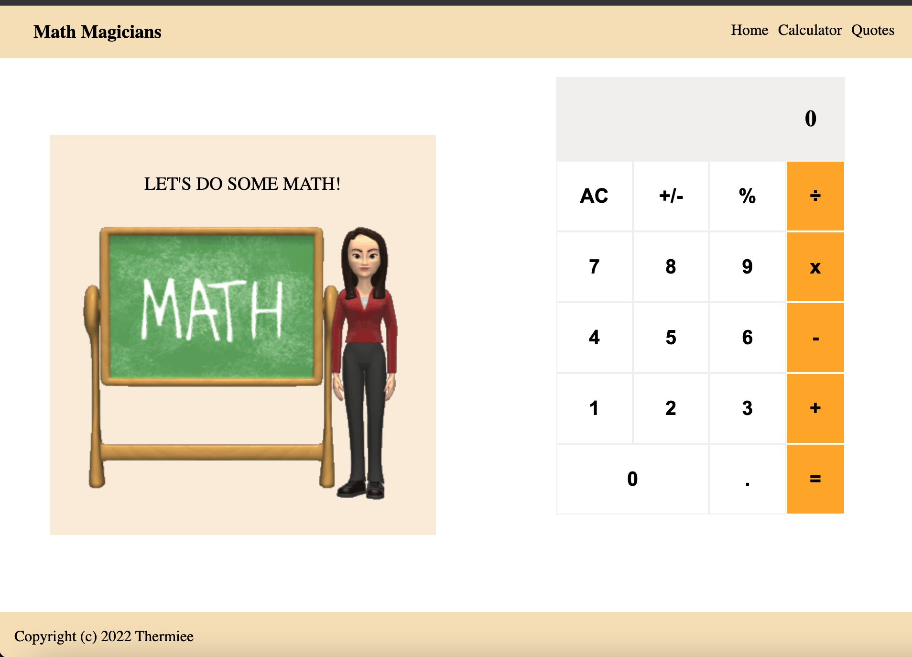

# Math Magicians
Math Magician app basic setup.

## Live Demo

[Heroku Demo Link](https://thermiee-math.herokuapp.com)

[Netlify Demo Link](https://brilliant-semifreddo-5fcc98.netlify.app/)

# Built with
- React.js
- CSS
# Other tools
- Babel compiler

Runs the app in the development mode.\
Open [http://localhost:3000](http://localhost:3000) to view it in your browser.
The page will reload when you make changes.\
You may also see any linter errors in the console.

# Author
**Emmanuel Jolugbo**
- GitHub: [@Thermiee](https://github.com/Thermiee)

## :handshake: Contributing
Contributions, issues, and feature requests are welcome!
## Show your support
Give a :star:️ if you like this project!
## Acknowledgments
- Microverse
